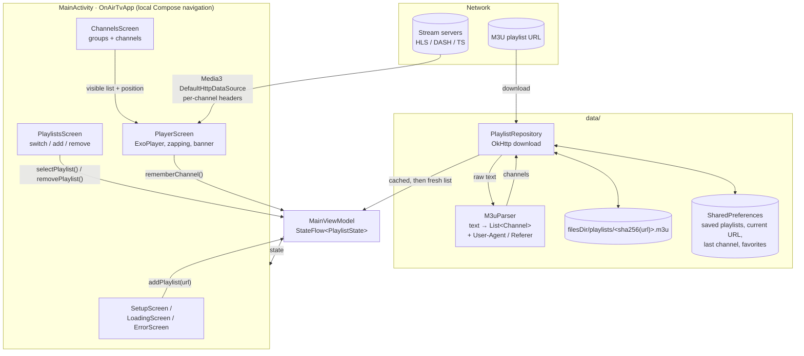
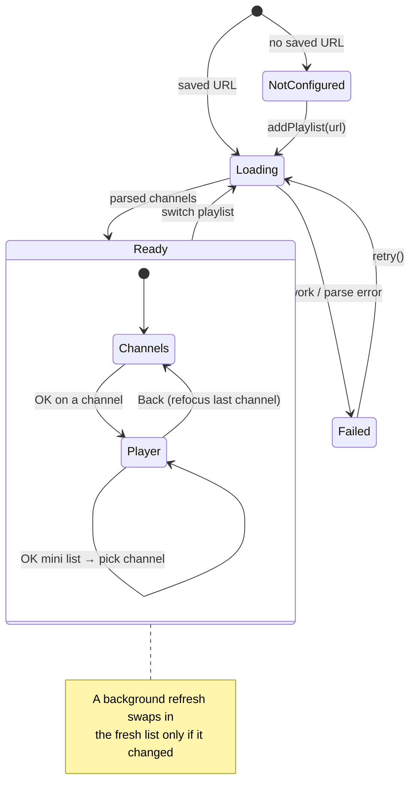

# OnAir TV: a minimal IPTV player for Google TV / Android TV

An MVP IPTV player in the spirit of TiviMate. It loads any M3U playlist (including the
[iptv-org](https://github.com/iptv-org/iptv) lists), shows channels by group and plays them
full-screen with remote-control zapping.

**Stack:** Kotlin · Jetpack Compose for TV (`androidx.tv:tv-material`) · Media3 ExoPlayer (HLS/DASH/TS) · OkHttp · Coil

## Features in this MVP

- Add a playlist by URL, or pick one of the iptv-org presets (India, Malayalam, News, All).
- Multiple saved playlists: **Playlists** (on the channel list) switches between them, adds new
  ones, or removes them (press ▶ on a playlist to reach its Remove button).
- Each playlist is cached on disk, so the app opens instantly and refreshes in the background.
- Channel browser: a group list on the left and channels with logos on the right.
- Favorites: hold OK on a channel (in the list or while watching) to star it. Starred channels
  appear in the **★ Favorites** group.
- Search: find channels by name across the whole playlist, ignoring case and accents. Each word
  must match, in any order. Back clears the search.
- Full-screen playback:
  - ▲/▼ or CH+/CH− switch channels. Quick presses are debounced.
  - OK opens a mini channel list over the video, focused on the current channel. Pick one with
    OK; Back or ◀ closes it. Info shows the channel banner.
  - Hold OK to add or remove the channel from favorites (in the mini list too).
  - Zapping stays inside the list you started from (a group, Favorites, or search results).
  - Back returns to the list, focused on the channel you were watching.
- Per-channel `User-Agent` / `Referer`, from `#EXTVLCOPT` lines, attributes, or Kodi-style `url|User-Agent=…`.
- URLs with no file extension are retried as HLS if the first attempt fails.
- The app remembers the last channel you watched.

## Project layout

```
app/src/main/java/dev/onairtv/app/
├── MainActivity.kt          # entry point + simple screen navigation
├── MainViewModel.kt         # playlist state (NotConfigured / Loading / Failed / Ready)
├── data/
│   ├── M3uParser.kt         # extended-M3U parser → List<Channel>
│   ├── ChannelSearch.kt     # channel-name search (case/accent-insensitive)
│   ├── SavedPlaylists.kt    # saved-playlist list: storage format, default names
│   └── PlaylistRepository.kt# download, disk cache, preferences, favorites
└── ui/
    ├── SetupScreens.kt      # add-playlist, loading, error screens
    ├── PlaylistsScreen.kt   # saved playlists: switch, add, remove
    ├── ChannelsScreen.kt    # groups + channel list (D-pad focus handling)
    └── PlayerScreen.kt      # ExoPlayer, zapping, channel banner
```

## Architecture

A single-module app with no DI framework. Data flows one way: repository → view model → Compose UI.
The player streams directly from the channel URLs and does not go through the repository.



`OnAirTvApp` chooses the screen from `PlaylistState` and a few pieces of local state
(`showSetup`, `showPlaylists`, `selectedGroup`, `playback`):



## Build and run

1. Install **Android Studio** (a recent stable version). Choose **Open** and select this folder,
   then let Gradle sync. It downloads the Android SDK pieces and dependencies it needs.
2. **Emulator:** open Device Manager, choose Create device, pick the **TV** category (Google TV 1080p),
   and select an API 34 or 35 image. Your PC keyboard's arrow keys, Enter and Esc act as the remote.
3. Press **Run ▶**. The app appears on the TV home screen as "OnAir TV".

## Install on a real Google TV (sideload)

1. On the TV, go to **Settings → System → About** and click **Android TV OS build** 7 times
   to enable Developer options.
2. In **Settings → System → Developer options**, turn on **USB debugging** and **Wireless / network debugging**.
3. Find the TV's IP address under **Settings → Network**. Then, from your computer:
   ```bash
   adb connect <tv-ip>:5555        # accept the prompt on the TV
   ./gradlew installDebug          # or: adb install app/build/outputs/apk/debug/app-debug.apk
   ```
   Newer Google TV builds may use a pairing code instead. In that case run `adb pair <ip>:<port>`
   with the code shown on the TV, then `adb connect`.

## Notes

- `usesCleartextTraffic="true"` is set because many IPTV streams are plain `http://`.
- The full `index.m3u` has many thousands of channels. It works, but a country or language
  playlist loads much faster.
- **Before publishing to the Play Store,** remove the `PRESETS` in `SetupScreens.kt`. The app
  should ship as a pure player with no bundled channel links.

## Next steps

1. XMLTV EPG import → "now / next" on each channel.
2. Full EPG grid.
3. Settings: buffer size, decoder preference, stream timeouts.

## License

OnAir TV is licensed under the [GNU Affero General Public License v3.0](LICENSE) (AGPL-3.0).
